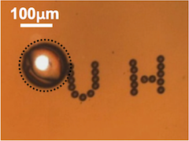

In this project, me and my subteam is responsible for making a microchannel which can measure the impedance of a bead in a microchannel. We used AutoCAD to design the layout, PDMS and a mold (which was created in a previous semester) to make one type of microchannel, and a circuit board which used the LPKF laser printer to cut out the channel and electrodes. The LPKF design was not able to finish as the laser printer stopped working, but we were able to use the PDMS design to take some measurements. There is another subteam which is working on something to process images.

Last semester, I learned about water flow calculations, how to use PDMS to make microchannels, how to use the LPKF laser machine to make circuit boards, and how to take measurements using an impedance analyzer. This experience taught me a lot about those things, as well as giving me a glimpse of how a project might be run if I were working for a company. Our advisor, Dr. Aaron Ohta, taught us how a project might develop such as interviewing/surveying people for product ideas, making a project proposal (which might be used to get funding from the company or investors and whatnot), as well as doing weekly presentations to explain progress and future plans. We also created a video to explain what we did as well as wrote a final report. I was responsible for doing each of these things, however I would always have at least 1 senior member with me guiding me or sometimes doing things which might be expensive to make a mistake.

The following information can be found at the <a href="https://manoa.hawaii.edu/uh-vip/project/micro-vip/"><i class="large github icon "></i>UH website</a>

Goals:
Design and implementation of microfabricated systems for engineering and healthcare applications, including microfluidic systems, optically controlled microrobots, and cell analysis technologies.

Key elements:
Microfabrication, microfluidics, microscopy, optical systems, image processing, machine learning, computer vision, path planning, feedback control systems

Research issues:
Our research group has developed optically controlled microrobots, which are tetherless sub-millimeter actuators. The microrobots can be used to move around objects that are less than a millimeter in size. These microrobots can be used to pattern cells in specific locations, which enables studies on cell-to-cell communications, and can give insight into treating various diseases. Videos of the UH microrobots in action can be found here: <a href="http://www.youtube.com/user/mnmlab"><i class="large github icon "></i>link</a>

We are also working on various projects that utilize microfabricated devices and systems, including systems that can encapsulate single cells into droplets, deep learning systems for cell analysis, and others.

Advisor(s):
Aaron Ohta

Partners and sponsors:
UH John. A. Burns School of Medicine, UH Foundation

Majors, preparation, interests:
EE, ME: Interest in microfabrication, microfluidics, optical systems
EE, CEng: Background/interest in programming, control systems, machine learning, AI, deep learning
BioE: Background/interest in cell manipulation, cell analysis

Contact information:
Aaron Ohta, aohta@hawaii.edu
