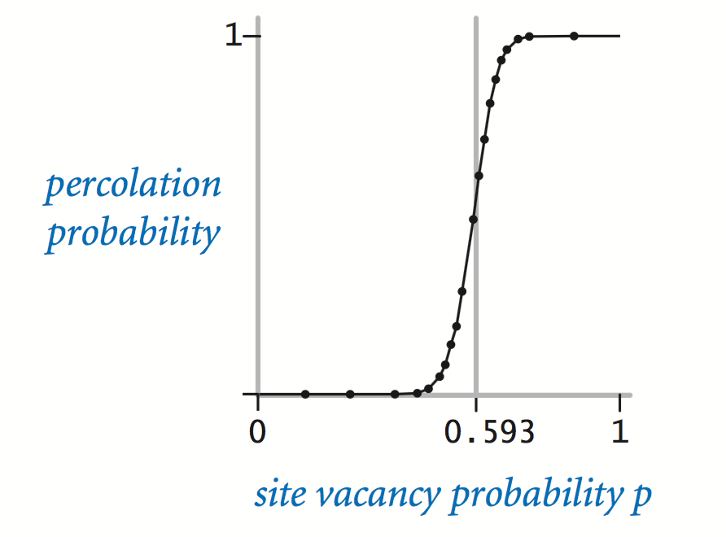
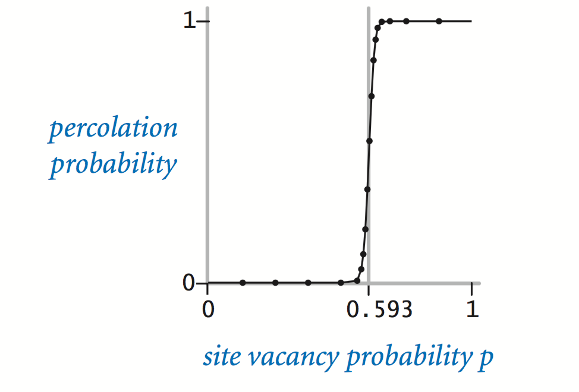

This project was from my EE602 Algorithms class. To summarize, we implement so that we can figure out if the grid/array percolates. Percolation is where water can travel through a path from top to bottom, meaning we must check that there is a path of open tiles from the top row to the bottom row. When that is implemented, we must run tests to determine the site vacancy probability (which should be about 0.593).

In this project I learned about testing edge cases and Java. I haven't used Java much in recent times so it gave me a lot of practice with it and I learned a lot of new functions which I haven't known about before. I also haven't used IntelliJ before so I got a decent idea of how it worked from this project.

The following information is from the Princeton Percolation assignment on 
<a href="https://coursera.cs.princeton.edu/algs4/assignments/percolation/specification.php"><i class="large github icon "></i>coursera</a>

Percolation. Given a composite systems comprised of randomly distributed insulating and metallic materials: what fraction of the materials need to be metallic so that the composite system is an electrical conductor? Given a porous landscape with water on the surface (or oil below), under what conditions will the water be able to drain through to the bottom (or the oil to gush through to the surface)? Scientists have defined an abstract process known as percolation to model such situations.

The model. We model a percolation system using an n-by-n grid of sites. Each site is either open or blocked. A full site is an open site that can be connected to an open site in the top row via a chain of neighboring (left, right, up, down) open sites. We say the system percolates if there is a full site in the bottom row. In other words, a system percolates if we fill all open sites connected to the top row and that process fills some open site on the bottom row. (For the insulating/metallic materials example, the open sites correspond to metallic materials, so that a system that percolates has a metallic path from top to bottom, with full sites conducting. For the porous substance example, the open sites correspond to empty space through which water might flow, so that a system that percolates lets water fill open sites, flowing from top to bottom.)

 

The problem: In a famous scientific problem, researchers are interested in the following question: if sites are independently set to be open with probability p (and therefore blocked with probability 1 − p), what is the probability that the system percolates? When p equals 0, the system does not percolate; when p equals 1, the system percolates. The plots below show the site vacancy probability p versus the percolation probability for 20-by-20 random grid (left) and 100-by-100 random grid (right).

  
